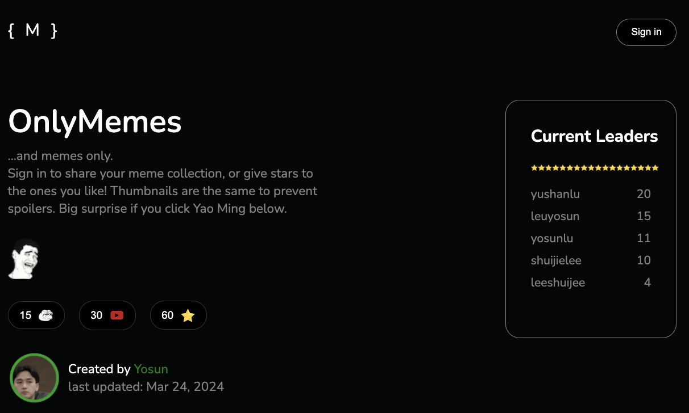
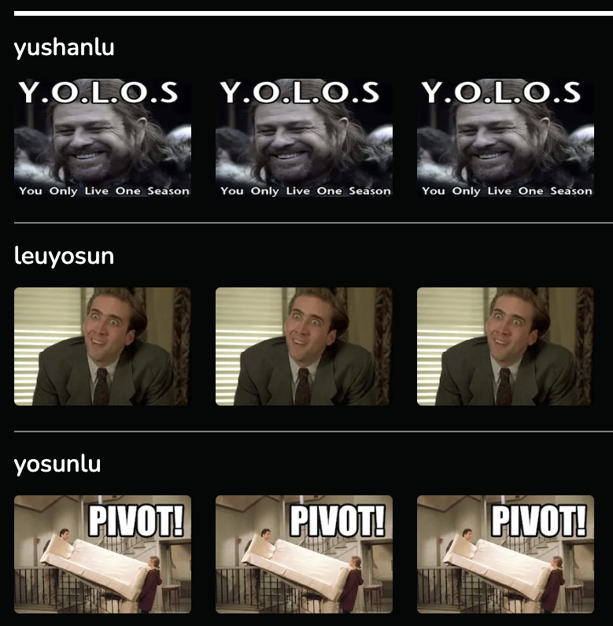

# OnlyMemes
## Introduction

As a meme enthusiast, I love to share memes with others, but quite often I get ignored (已讀), or even worse, they don't appreciate my sense of humor. To show that my sense of humor surpasses that of all my friends, I created this website, which allows user to sign in with google account and upload their favorite memes in the form of video. Users can give stars to the memes they like, and the website will show the current leaders, and display users' memes in the order of total stars acquired.

There are several functions under construction (listed below), but at current state users are free to sign in and upload videos: [onlememes.web.app](https://onlememes.web.app/)

## Visuals
👽 Users can sign in by clicking the sign-in button  
👽 Current Leaders board disaplays the leaders and their stars
👽 Be sure to hover over the Yao Ming icon

👽 After signing in, the upload button will appear

👽 Videos will be dislpayed in the order of total stars  
👽 Thumbnails are the same to prevent spoilers

  

## Technologies used
Just to clarify, this is NOT some random youtube clone projects on youtube that uses Youtube APIs! (that was mouthfull)    
I (kind of) built my own server, and dealt with uploading and watching the videos myself 

👽 Frontend: React.js, Next.js  
👽 Backend: Node.js Express.js  
👽 Database & Authentication: Firebase, including Firestore, Functions, Authentication  
👽 Cloud Services: Google Cloud Platform, including Cloud Run, Bucket (Cloud Storage), Pub/Sub  

### Architecture
**Video processing**  
- Corresponding code can be found at /video-processing-service
- Video-processing service is containerized, image of which pushed to Google Artifacts, and running on Cloud Run  
- There are two buckets on Google Buckets, raw and processed video
- When a video is uploaded (will talk in detail below), it is being uploaded to the raw bucket
- When the video is "finalized" in the raw bucket, a notification will be created by Pub/Sub (set by the following CLI)
`gsutil notification create -t video-uploads-topic -f json -e OBJECT_FINALIZE gs://memes-only-raw-videos`
- The notificaiton will be sent to Video-processing service end point (can be seen as `/process-video` at /index.ts) hosted on Cloud Run; once the video is downloaded and processed (in my case, being converted to 360p, at /index.ts and /storage.ts ) locally , it will be uploaded to the processed-video bucket
  - This adds durability layer for video upload events and process videos asynchronously 
- The nature of video processing can lead to inconsistent workloads, so use Cloud Run to scale up and down as needed
- Google Cloud Storage is simple, scalable, and cost effective solution for storing and serving large files

**APIs**
- Corresponding code can be found at /onlymemes-api-services
- Both functions are written at /index.ts, and deployed at Firebase (which connects to Cloud Run) with: `firebase deploy --only functions:generateUploadUrl`
- generateUpdateUrl()
  - When a video is uploaded by the client, the frontend will call uploadVideo() (/onlymemes-web-client/app/firebase/functions.ts) and generateUpdateUrl(), and generate an authenticated URL (permission of access to the bucket for this function needs to be granted)
  - generateUpdateUrl() returns a signed-URL; this signed-URL containes information (i.e. path) to upload the video
  - Once the video is uploaded to the raw bucket, Pub/Sub will be triggered
- getVideos()
  - this accesses Firestore's collection of videos, and returns an array of video data
  - like generateUpdateUrl(), this function is wrapped and called by the frontend (/onlymemes-web-client/app/firebase/functions.ts)

**Firestore**
- Firestore Database has two collections: users and videos; they are used to store metadata (email, filename, processed/processing, etc.)
- setVideo() (/video-processing-service/src/index.ts) will change the status of the video after the user uploads it, and after video-proceesing-service finishes converting and upload it to the processed-bucket

**Authenticaion**
- Firebase Auth is used to handle user authentication, making it easier to integrate with Google Sign In

**Deployment**
- Firebase Hosting is used for the frontend domain. It is quite easy to integrate with GCP projects. Documentations can be found here: https://cloud.google.com/run/docs/mapping-custom-domains#https-load-balancer

## To-dos

The main focus of the project has been to create a video-processing service and an architecture similar to that of Youtube. There are still many functions that will be added in the future:

👽 Each user has a row with their own videos  
👽 Star count for each video  
👽 Total star counts, and ddjust leadership board/display of videos accordingly  
👽 Each user can star 10 videos a day  
👽 User can add topic for the videos they upload  
👽 User can choose their own thumbnail (from ones I provide)  
👽 Animations when ranking changes  
👽 Responsiveness

